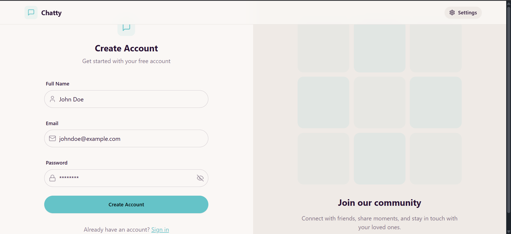
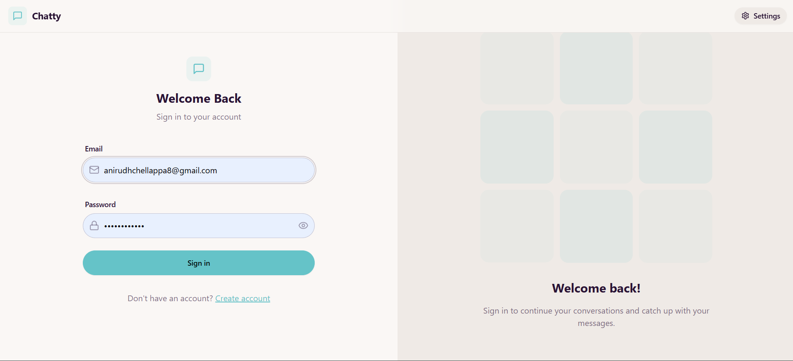
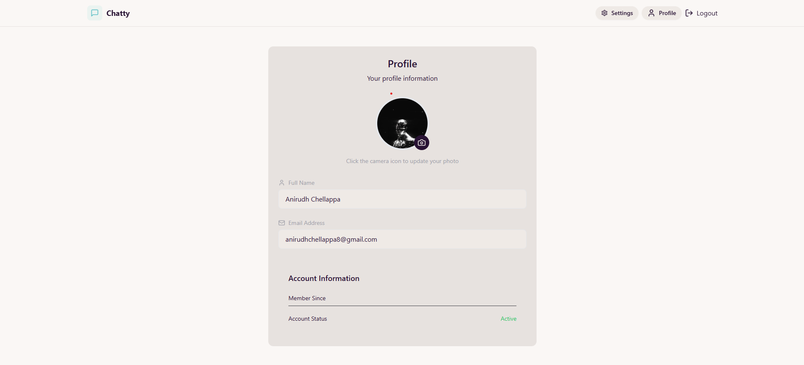
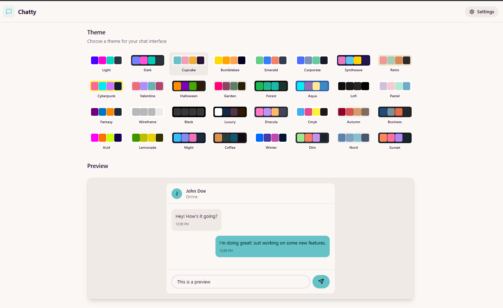
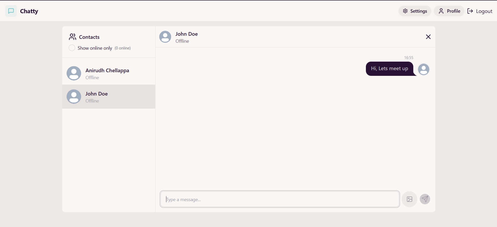
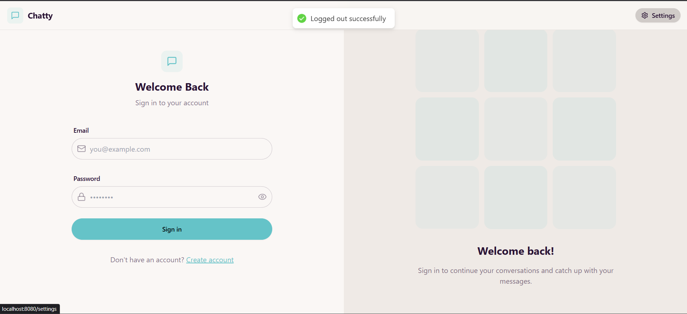

# 🚀 Dockerized Chat Platform

A fully containerized, real-time chat application built using **MERN Stack + Socket.IO**, packaged with **Docker & Docker Compose** for seamless local development and production deployment.

This README includes:

* Setup steps
* Tech stack used
* Screenshots
* Bonus features implemented

---

# 📝 Introduction

The **Dockerized Chat Platform** is a scalable real-time chat application with secure authentication, modern UI, and WebSocket-based messaging. The system is optimized for containerized environments using Docker.

---

# ✨ Features

* ⚡ **Real-time Messaging** using Socket.IO
* 🔐 **JWT Authentication & Authorization**
* 👤 **User Profiles & Avatars**
* 🟢 **Online/Offline Status Tracking**
* 💬 **Modern UI with React + TailwindCSS**
* 🐳 **Fully Dockerized (Frontend + Backend + DB)**
* 📡 **REST APIs for Auth & Messaging**
* 🔒 **Secure CORS & Cookie Handling**

---

# 🛠️ Tech Stack

### **Frontend**

* React (Vite)
* TailwindCSS
* Zustand (State Management)
* DaisyUI
* Socket.IO Client
* Axios

### **Backend**

* Node.js + Express
* Mongoose (MongoDB)
* Socket.IO Server
* JWT Authentication
* Cookie Parser & CORS

### **Database**

* MongoDB (Docker container)

### **Infrastructure**

* Docker
* Docker Compose
* NGINX (serving frontend)

---

# 🔧 Prerequisites

* Node.js (v14+)
* Docker Desktop
* Git

---

# 📝 Environment Configuration

Create a `.env` file inside the **backend** directory:

```env
PORT=5001
MONGO_URI=mongodb://mongo:27017/chatApp
JWT_SECRET=your_secret_key_here
NODE_ENV=production
```

---

# 📦 Setup Steps

### 1️⃣ Clone the Repository

```bash
git clone https://github.com/AnirudhC22/dockerized-chat-platform.git
cd dockerized-chat-platform
```

### 2️⃣ Build & Run Using Docker Compose

```bash
docker-compose up --build -d
```

### 3️⃣ Access the Application

| Component      | URL                                                          |
| -------------- | ------------------------------------------------------------ |
| Frontend       | [http://localhost:8080](http://localhost:8080)               |
| Backend API    | [http://localhost:5001](http://localhost:5001)               |
| Backend Health | [http://localhost:5001/health](http://localhost:5001/health) |

### 4️⃣ Stop the Application

```bash
docker-compose down
```

---

# 🖼️ Screenshots

## 🆕 Create Account


## 🔐 Login Page


## 👤 User Profile


## ⚙️ Settings Page


## 💬 Chat Window


## 🚪 Logout



---

# 🎁 Bonus Features / Assumptions

* WebSocket reconnection handling
* Production-grade folder structure
* Docker healthchecks for backend
* Optimized NGINX config for React build
* Secure cookie/token management

---

# 🤝 Contributing

We welcome contributions of all kinds!

* Report issues
* Suggest features
* Submit PRs

Star ⭐ the repo if you find it useful!

---

# 📜 License

This project is licensed under the **MIT License**.
